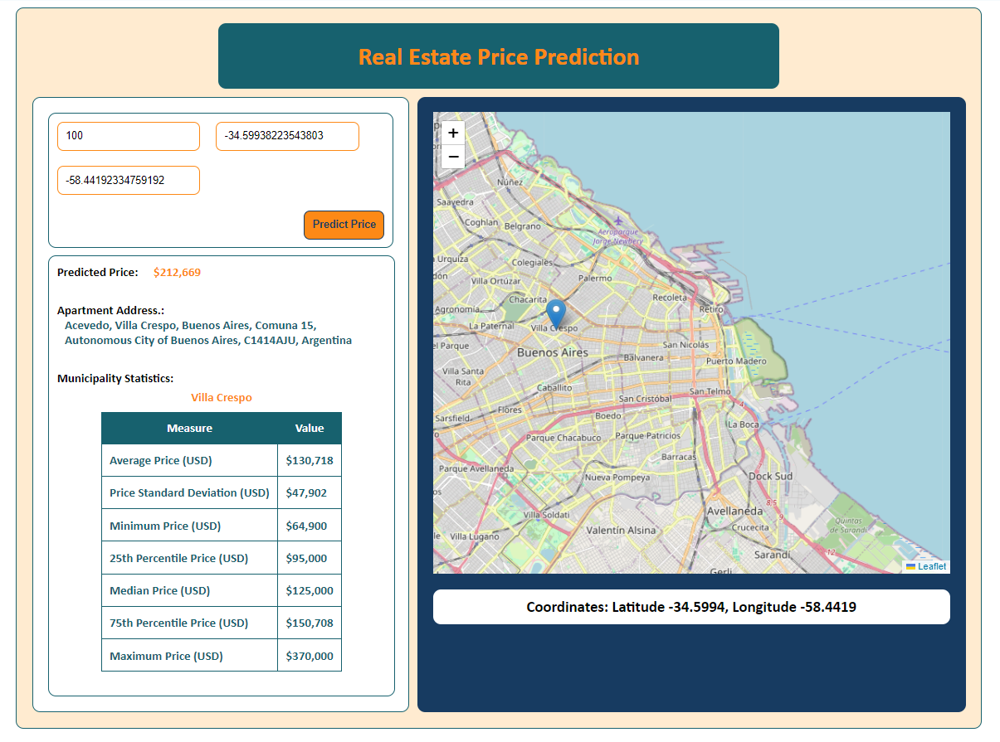

# Buenos Aires Real Estate Price Prediction



## Introduction

This project aims to predict the prices of apartments in Buenos Aires, Argentina, using a robust machine-learning model. The focus is on properties costing less than $400,000. Accurate price predictions are crucial for various stakeholders, including buyers, sellers, real estate agents, and policymakers. Our objective was to develop a reliable model despite the absence of temporal indicators.

## Problem Statement

The goal is to identify significant features that accurately predict apartment prices in Buenos Aires and to achieve a Mean Absolute Error (MAE) of less than 50% compared to a baseline model.

## Methodology

We followed a prescriptive methodology to guide our model development:

1. **Data Collection**: Scraped 12,000+ apartment listings from real estate websites.
2. **Data Preprocessing**: Cleaned the dataset by handling missing values, converting data types, removing duplicates, and normalizing features.
3. **Exploratory Data Analysis (EDA)**: Conducted to understand feature distributions and relationships.
4. **Feature Engineering**: Extensively used to identify the most significant features.
5. **Modeling**: Iteratively experimented with various models, including multiple versions of the Ordinary Least Squares (OLS) model.
6. **Handling Heteroskedasticity**: Identified and addressed this issue to improve model accuracy.
7. **Final Model**: Selected a Gradient Boosting Regressor based on performance, which achieved the best results.

## Results

- **Optimal High Leverage Threshold**: 0.0003
- **Optimal High Residual Threshold**: 3
- **Mean Absolute Error (MAE)**: $23,809.9879
- **R²**: 0.7863
- **MAE Improvement**: 60% better than the baseline

The final model successfully handled heteroskedasticity and outperformed previous iterations.

## Libraries Used

- **Python**: Core language used for development.
- **Pandas**: For data manipulation and analysis.
- **NumPy**: For numerical operations.
- **Matplotlib**: For data visualization.
- **Seaborn**: For statistical data visualization.
- **Plotly**: For interactive graphs.
- **Dash**: For web-based application development.
- **Scikit-learn**: For machine learning modeling.
- **Statsmodels**: For statistical modeling.

## Dependencies

Make sure to install the following dependencies before running the project:

```bash
pip install pandas numpy matplotlib seaborn plotly dash scikit-learn statsmodels
